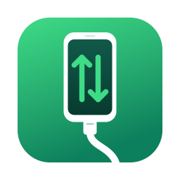
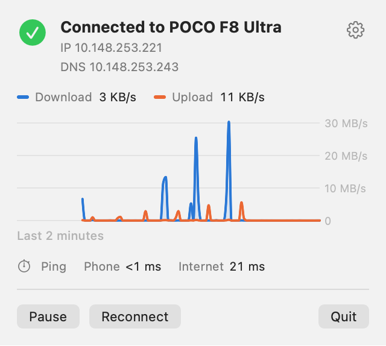
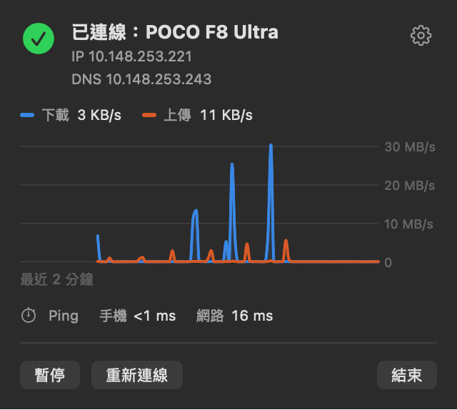

<p align="center"></p>

<h1 align="center">Tetherline</h1>

<p align="center">
USB tethering for macOS, from Android phones and 4G/5G USB modems: a menu bar app plus a small user-space driver.<br>
No kernel extension, no DriverKit, no SIP changes, and DNS that actually follows the phone.
</p>

<p align="center"><sub>Formerly DroidTether. The bundle identifier, the background service, its settings and its log keep the old name.</sub></p>

<p align="center"><a href="#繁體中文">繁體中文</a></p>

<p align="center"></p>

## Why another one?

macOS has no RNDIS driver, HoRNDIS no longer loads on Apple Silicon without lowering security, and the user-space tools I tried kept breaking DNS. Two things were wrong:

1. **DNS was never applied.** The tool wrote only `State:/Network/Service/<id>/DNS` to the SystemConfiguration dynamic store. `configd` ignores a service that has DNS but no `IPv4` entity, so the Mac kept resolving over Wi-Fi, or not at all once Wi-Fi was off.
2. **`utun` confuses Tailscale.** Network.framework reports `utun` interfaces as type `other`. Tailscale filters those out and decides the network is down, so the tailnet (and MagicDNS) drops while tethering.

Tetherline fixes both:

- The tether is registered as a complete network service, with `IPv4`, `DNS` and `OverridePrimary`. `configd` then moves the default route and the resolver to the phone itself. Wi-Fi can stay on.
- A full-tunnel VPN still wins. With a Tailscale exit node on, `configd` keeps the VPN's default route even though the tether asks for `OverridePrimary`, and Tetherline adds no routes of its own to override that, so the VPN's traffic stays inside the tunnel. `tests/vpn_logic_test.py` checks this from both orders: exit node first, or tether first.
- The service is written with `SCDynamicStoreAddTemporaryValue`, so `configd` removes it when the daemon exits, even on `kill -9`. Wi-Fi takes over again within a few seconds.
- The Mac side is a `feth` pair (macOS's built-in fake Ethernet), which Network.framework reports as `wiredEthernet`. Tailscale and other `NWPathMonitor` users keep working.
- DNS defaults to the server the phone hands out over DHCP. A custom list is optional. Some tethering tools say Android's USB link does not proxy DNS and always use public servers. On a POCO F8 Ultra with HyperOS the phone's own DNS does answer over the USB link: a direct query to it with Wi-Fi off came back in under 100 ms, and the live test asks it directly on every run. Other phones may differ, so Tetherline asks the phone first and falls back to 8.8.8.8 and 8.8.4.4 only if it gets no answer. It then asks the phone again every minute and switches back once it answers.

### 4G/5G USB modems (MBIM)

USB modems are the other half. Many can switch to ECM, which macOS supports, but then the modem's own router does the dialing and NAT. On the author's plan the carrier counts that as hotspot sharing; in MBIM mode, where the computer itself dials as Windows and Linux do, it does not. macOS has no MBIM driver.

Tetherline speaks MBIM itself: it opens the modem's control channel, waits for the SIM and network registration, dials with an APN (default `internet`), reads the address the network assigns, and carries IP packets in NTB16 blocks. The Mac side is the same `feth` pair, with the Ethernet headers and ARP replies made up by the daemon, so DNS, the VPN behaviour, Wi-Fi handling and the panel all work the same way. When a modem says it is connected but nothing comes back (some firmware does this every few hours), the daemon notices from unanswered pings while idle and resets the modem over USB.

Status: the MBIM code has run against a TCL LINKKEY IK512 (Qualcomm SDX62) on a Linux host (`tests/mbim_probe.c`: dial, ping 8.8.8.8 and 1.1.1.1, full-size packets, a burst of 50, DNS), and every request it builds matches libmbim byte for byte. The full path on macOS has not been tried yet.

## Features

- Enable USB tethering on the phone and the Mac is online about a second later. Unplug and Wi-Fi comes back.
- 4G/5G USB modems in MBIM mode: plug in and the Mac dials with the configured APN.
- Menu bar panel: status, IP and DNS, a two-minute traffic graph, and ping to the phone (the USB link) and to 1.1.1.1 (through the phone).
- Pause, resume and reconnect.
- Settings: use the phone as the main connection or not, DNS (from the phone or custom), turn Wi-Fi off while connected, open at login.
- Tells you when a phone is plugged in but USB tethering is off, or when another app is holding the device.
- English and Traditional Chinese, following the system language.
- The background service is registered with `SMAppService`: one switch in System Settings, no installer and no password.

Menu bar icon, left to right: connected, connecting, not connected, paused.


## How it works

```
Android phone (RNDIS)              4G/5G USB modem (MBIM)
   │  USB: control + bulk endpoints, via libusb
droidtetherd  (root, started by launchd through SMAppService)
   │  RNDIS ⇄ Ethernet frames · DHCP client with lease renewal
   │  MBIM: control channel, APN dial-up, NTB16 ⇄ IP packets, ARP answered by the daemon
   │  BPF on feth7701
feth7701 ⇄ feth7700   macOS fake-Ethernet pair; feth7700 holds the IP, the kernel does ARP
   │
configd  ← State:/Network/Service/DroidTether/{IPv4,DNS}   (OverridePrimary, temporary values)
   │
default route and DNS → the phone

Tetherline.app (menu bar) ⇄ /var/run/droidtetherd.sock ⇄ droidtetherd
```

- `src/` is the daemon, in C (about 3,500 lines): USB discovery, RNDIS, DHCP, MBIM, `feth`/BPF, SystemConfiguration and the control socket.
- `app/` is the menu bar app, in SwiftUI. It talks to the daemon over a Unix socket, one command per line and one JSON reply.
- Only the RNDIS or MBIM control and data interfaces are claimed. ADB, and a modem's AT and diagnostic ports, stay free.

## Requirements

- macOS 26 or later on Apple Silicon. That is what it is built for and tested on (deployment target 26.0, arm64).
- An Android phone that tethers over RNDIS (USB interface class `EF/04/01`, `E0/01/03` or `02/02/FF`). Tested with a POCO F8 Ultra on HyperOS.
- Or a USB modem in MBIM mode (interface class `02/0E/00`) with a SIM that does not need a PIN. See the status note above.
- To build: the Xcode command line tools (Swift 6), `libusb` from Homebrew, and an Apple Development code-signing identity. I have only tested the `SMAppService` background service with a properly signed app.

## Download

Signed with Developer ID and notarized by Apple: get the DMG from the [latest release](https://github.com/jason5545/Tetherline/releases/latest), drag Tetherline into Applications and open it. Then allow the background item as described below.

## Build and install

```bash
brew install libusb
git clone https://github.com/jason5545/Tetherline.git
cd Tetherline
make test
make install
open /Applications/Tetherline.app
```

`make install` builds the daemon and the app, signs both with your `Apple Development` identity, and copies the app to `/Applications`. If your keychain has more than one, pick it with `SIGN_ID="Apple Development: Your Name (TEAMID)"`.

On first launch, macOS asks you to allow the background item. Turn on **Tetherline** under **System Settings → General → Login Items & Extensions**; the panel has a button that opens that page. After an update, the app notices that the running daemon is older and restarts it from the new bundle.

## Using it

- Turn on USB tethering on the phone. If your ROM keeps the AOSP developer option **Default USB configuration**, setting it to *USB tethering* skips this step every time you plug in.
- Click the menu bar icon for the panel. The gear opens Settings. Opening Tetherline again from Applications or Spotlight also brings up Settings.
- **Modems** dial with the APN `internet` unless told otherwise; it is what the Taiwanese carriers use. To change it: `echo 'set apn YOUR.APN' | nc -U /var/run/droidtetherd.sock`. There is no field for it in Settings yet.
- **Use as the main connection** (on by default) sends all traffic and DNS through the phone. Turn it off to keep Wi-Fi primary and leave the tether available as a secondary interface.
- **Turn off Wi-Fi while connected** (off by default) switches Wi-Fi off once the tether is up, and back on when you unplug the phone, turn tethering off on the phone, pause, or quit. Only Wi-Fi that Tetherline switched off comes back on: if it was already off when you plugged in, or you turn it back on yourself while connected, Tetherline leaves it alone. It works only while the phone is the main connection. Wi-Fi usually rejoins within a couple of seconds after you unplug; until then the Mac has no connection. If the background service stops and launchd cannot start it again (for example after switching between differently signed copies, see Troubleshooting), the menu bar app turns that Wi-Fi back on after 10 seconds.
- **With Tailscale's "Use Tailscale DNS" on**, Tailscale can handle DNS first. On the test machine (tailnet global nameservers 8.8.8.8 and 8.8.4.4), macOS sent ordinary names to 100.100.100.100 rather than to the phone, even with Tetherline as the main connection. Tetherline's DNS setting then only matters for queries that reach the system resolvers; traffic, including Tailscale's own DNS forwarding, still goes through the phone. In `scutil --dns` this shows up as a Tailscale resolver with no `domain` and a lower `order` than Tetherline's.

## Troubleshooting

| What you see | What to check |
|---|---|
| "Turn on USB tethering on the phone" | The phone is plugged in but exposes no RNDIS interface yet. |
| "… is in use by another app" | Quit any other tethering tool that might hold the device. |
| Connected, but names don't resolve | `scutil --dns` should list the phone's DNS as the default resolver, and `printf 'show State:/Network/Global/IPv4\n' \| scutil` should show `PrimaryService : DroidTether` (the service keeps the old name). A Tailscale resolver with no domain and a lower `order` means Tailscale answers names first (see Using it). `dig @<DNS from the panel> example.com` asks the phone directly, bypassing both. |
| Modem: "No SIM card", "SIM card is locked", "could not register" | The modem reports this itself. Check the SIM in a phone first; PIN entry is not supported, so remove the PIN there. |
| Modem: "refused the data connection; check the APN" | The network rejected the APN. Set the one your carrier publishes (see Using it); the log shows the MBIM status and network error code. |
| Ping works, websites hang | Some carriers drop large packets. Try a smaller MTU with the development build below (`--mtu 1380`). |
| Background service never starts after switching between a self-built copy and a downloaded one | `launchctl print system/io.github.jason5545.droidtether` shows `spawn failed` and `needs LWCR update`. launchd still holds the code requirement of the first copy that registered the service. Restarting the Mac clears it. Avoid keeping several copies of Tetherline.app (or an older DroidTether.app) around: macOS may resolve the bundled daemon from the wrong one. |

The daemon logs to `/Library/Logs/DroidTether.log`. To query it from a terminal:

```bash
echo status | nc -U /var/run/droidtetherd.sock
```

## Development

```bash
make            # daemon only: build/droidtetherd
make test       # packet tests, no device needed (uses tcpdump to double-check checksums if present)
make app        # build/Tetherline.app
python3 tests/dns_logic_test.py --quick   # live DNS/routing invariants with the phone connected, no disruption
python3 tests/dns_logic_test.py           # plus reconnect, pause, DNS and primary switches, Wi-Fi off while
                                          # connected, configd losing our entries, and a daemon crash
                                          # (the connection drops briefly)
build/test_mbim                           # part of make test: MBIM messages against bytes a TCL IK512 sent
build/test_mbim --dump > mbim.dump        # on a Linux host with libmbim: python3 tests/mbim_oracle.py mbim.dump
                                          # checks every request against libmbim, byte for byte
python3 tests/vpn_logic_test.py           # a Tailscale exit node layered on the tether keeps the default route
                                          # (switches to an exit node and back; needs Tailscale online)
swiftc -O -parse-as-library app/Sources/WifiGuard.swift tests/wifi_guard_test.swift -o build/wifi_guard_test
build/wifi_guard_test                     # when the app turns Wi-Fi back on (toggles Wi-Fi, restores it)
```

The live test also reproduces the DNS-only write that broke the tools this project replaces, and checks that `configd` ignores it while Tetherline's entry is the one in use.

`tests/mbim_probe.c` runs the same MBIM code against a real modem on a Linux host, with no interface and no routes: it dials, pings and queries DNS by itself. AGENTS.md has the steps used on the author's Proxmox host.

To run the daemon by hand, first turn Tetherline off under Login Items so the installed copy releases the phone (only one instance can run). Then:

```bash
sudo build/droidtetherd -v --no-primary --pcap /tmp/tether.pcap -c /tmp/droidtether.conf
```

`--no-primary` leaves Wi-Fi as the main connection, so you can test through the tether with `curl --interface feth7700` without cutting yourself off. `--pcap` records the first 128 bytes of every frame that crosses USB.

Control socket commands (`/var/run/droidtetherd.sock`, owned by `root:staff`, mode 0660):

| Command | Effect |
|---|---|
| `status` | JSON with state, device, addresses, byte counters and settings |
| `set enabled 0\|1` | Pause or resume |
| `set primary 0\|1` | Use as the main connection or not |
| `set dns phone` / `set dns 1.1.1.1,8.8.8.8` | DNS source |
| `set wifi_off 0\|1` | Turn Wi-Fi off while connected (applies without reconnecting) |
| `reconnect` | Drop and re-establish the connection |
| `quit` | Exit; launchd starts it again (used after updates) |

`Tetherline.app/Contents/MacOS/Tetherline --snapshot <prefix> [seconds]` renders the panel and the menu bar icons to PNG files. The screenshots in this README were made that way.

## Uninstall

1. Turn Tetherline off under **System Settings → General → Login Items & Extensions**, then choose **Quit** in the panel.
2. Delete `/Applications/Tetherline.app` (`DroidTether.app` for versions before 0.4).
3. Remove the settings and logs (they keep the old name):

```bash
sudo rm -rf "/Library/Application Support/DroidTether" /Library/Logs/DroidTether.log*
```

## Related projects

Several projects tackle the same problem, most of them started in 2026:

- [jwise/HoRNDIS](https://github.com/jwise/HoRNDIS), the original kernel extension.
- [XiaoMiku01/TetherKit](https://github.com/XiaoMiku01/TetherKit): libusb, `feth` and BPF in C++, with asynchronous USB transfers. The closest relative of this project.
- [noahhhi/HoRNDIS-Userspace](https://github.com/noahhhi/HoRNDIS-Userspace): IOUSBHost and `feth`, with careful privilege separation.
- [jost-s/macos-usb-tether-android](https://github.com/jost-s/macos-usb-tether-android) (muta): Rust, nusb and `utun`, with no `OverridePrimary` and no split routes so that a VPN on top keeps its traffic. Reading it is what led to the VPN test in this repository.
- [s4wbvnny/BetterTether](https://github.com/s4wbvnny/BetterTether) and [francescoterrito/android-rndis-macos](https://github.com/francescoterrito/android-rndis-macos): libusb with `utun`.
- [prostec-labs/TetherKit](https://github.com/prostec-labs/TetherKit): a DriverKit port, which needs entitlements approved by Apple.

Tetherline shares no code with any of them.

## License

[MIT](LICENSE)

---

## 繁體中文

Tetherline 讓 Mac 透過 USB 使用 Android 手機或 4G/5G USB 數據機的網路。它由選單列 App 和一個使用者空間的小驅動組成，不用 kext、不用 DriverKit，也不用關 SIP。

舊名 DroidTether。bundle ID、背景服務、設定檔和記錄檔沿用舊名。

<p align="center"></p>

### 為什麼要再寫一個

我原本用的工具每次開分享，DNS 都會出問題。查下去有兩個原因：

- 它只寫了 DNS，沒有寫 IPv4。`configd` 會直接忽略這種服務，所以 DNS 其實一直走 Wi-Fi，Wi-Fi 一關就沒有 DNS。
- 它用 `utun` 介面。Network.framework 把 `utun` 歸類成 `other`，Tailscale 會把它濾掉，然後判定網路斷線。

Tetherline 的做法：

- 把手機註冊成完整的網路服務（IPv4、DNS 加 `OverridePrimary`），由系統自己把預設路由和 DNS 切到手機。Wi-Fi 開著也沒關係。
- 開全通道 VPN 時讓 VPN 優先。實測開 Tailscale exit node 時，就算手機要求 `OverridePrimary`，系統還是把預設路由留給 VPN；Tetherline 也不自己加路由去蓋過它，VPN 的流量不會從手機明文出去。
- 用暫存值寫入，程式異常結束時系統會自動清掉，幾秒內就回到 Wi-Fi。
- Mac 這端用 `feth` 虛擬乙太網卡，Network.framework 認得它是有線網路，Tailscale 照常運作。
- DNS 預設用手機提供的，也可以自訂。有些工具說 Android 的 USB 網路共用不轉發 DNS，一律改用公共 DNS。在 POCO F8 Ultra（HyperOS）上實測，手機自己的 DNS 透過 USB 可以正常回應：關掉 Wi-Fi 直接問手機，不到 100 ms 就有答案，即時測試每次也會直接問一次。其他手機不一定一樣，所以 Tetherline 會先問手機，沒回應才改用 8.8.8.8、8.8.4.4，之後每分鐘再問一次手機，有回應就切回來。

開著 Tailscale 的「Use Tailscale DNS」時，DNS 可能先交給 Tailscale。測試機的 tailnet 設了全域 DNS（8.8.8.8、8.8.4.4），即使 Tetherline 是主要連線，macOS 一般網址也是先問 100.100.100.100，不會問手機。這時 Tetherline 的 DNS 設定只影響真正交到系統 DNS 的查詢；流量本身（包括 Tailscale 轉出去的 DNS 查詢）還是走手機。在 `scutil --dns` 裡看得到一筆沒有 `domain`、`order` 比 Tetherline 小的 Tailscale 項目。

### 4G/5G USB 數據機（MBIM）

很多數據機可以切成 macOS 支援的 ECM 模式，但那是數據機內建的路由器在撥號、做 NAT。作者的方案下，電信商把這種流量算成熱點分享；改用 MBIM、由電腦自己撥號（Windows、Linux 就是這樣），就不算。macOS 沒有 MBIM 驅動。

Tetherline 自己處理 MBIM：開控制通道、等 SIM 和註冊、用 APN 撥號（預設 `internet`，臺灣的電信商都用這個）、讀網路配的位址，資料用 NTB16 收送。Mac 這端一樣是 `feth`，乙太網路標頭和 ARP 由 daemon 補，所以 DNS、VPN、Wi-Fi 和面板的行為都跟手機一樣。數據機有時會「顯示連著但不通」，閒置時 ping 不回來，daemon 會透過 USB 把它重置。

目前進度：MBIM 的程式碼已經在 Linux 主機上接 TCL LINKKEY IK512（高通 SDX62）實際跑過（`tests/mbim_probe.c`：撥號、ping 8.8.8.8 和 1.1.1.1、滿載封包、連發 50 個、DNS），組出來的每種請求都跟 libmbim 逐位元組相同。macOS 上的完整流程還沒試。

### 功能

- 手機打開 USB 網路共用，大約一秒就連上；拔線自動回到 Wi-Fi。
- MBIM 模式的 4G/5G USB 數據機：插上就用設定的 APN 撥號。要改 APN：`echo 'set apn 你的APN' | nc -U /var/run/droidtetherd.sock`，設定畫面還沒有這個欄位。
- 選單列面板：連線狀態、IP 與 DNS、最近 2 分鐘的流量圖，以及兩種 Ping：「手機」是 USB 線路本身的延遲，「網路」是經過手機連到 1.1.1.1 的延遲。
- 暫停、恢復、重新連線。
- 設定：是否設為主要連線、DNS 來源、連線時關閉 Wi-Fi、登入時開啟。
- 連線時關閉 Wi-Fi（預設關閉）：連上手機後關掉 Wi-Fi，拔線、手機關掉分享、暫停或結束時再打開。只會打開 Tetherline 自己關掉的 Wi-Fi：接上前就是關的、或連線中你自己打開的，都不會去動。背景服務停掉又起不來時，選單列 App 等 10 秒後會把這個 Wi-Fi 打開。
- 手機接上但沒開分享、或被其他程式占用時，會直接提示。
- 介面有繁體中文和英文，跟著系統語言切換。
- 背景服務用 `SMAppService` 註冊，在系統設定開一個開關就好，不用跑安裝程式，也不用輸入密碼。

### 安裝

直接下載：到 [最新 release](https://github.com/jason5545/Tetherline/releases/latest) 下載 DMG（已用 Developer ID 簽章並通過 Apple 公證），把 Tetherline 拖進「應用程式」再打開。

自己編譯：需要 macOS 26 以上、Apple Silicon、Homebrew 的 `libusb`，以及 Apple Development 簽章憑證。

```bash
brew install libusb
git clone https://github.com/jason5545/Tetherline.git
cd Tetherline
make test
make install
open /Applications/Tetherline.app
```

第一次打開時，到「系統設定 → 一般 → 登入項目與延伸功能」允許 Tetherline 在背景執行。面板上有按鈕可以直接開那一頁。

記錄檔在 `/Library/Logs/DroidTether.log`。疑難排解、開發和移除方式請看上面英文段落的 Troubleshooting、Development、Uninstall。
